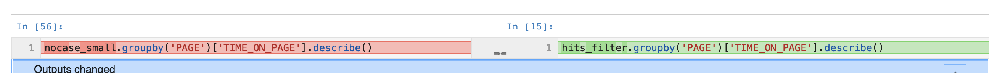

# Version Control with Jupyter Notebooks

Jupyter notebooks are a useful tool for data analysis and creating rich-text
reports that include code, text, tables, and graphics all in the same place,
but they can be a nightmare when it comes to **version control** and
**reproducibility**. Both these elements are critical for collaboration within
a data science team.

**Notebooks are poor for reproducibility**. Because notebooks are highly
dynamic, interactive documents, they encourage out-of-order execution,
re-execution of cells, and movement or deletion of cells. Therefore, another
person viewing the notebook may not be able to execute the notebook, or they
may return different results.

**Notebooks create unwieldy diffs in version control**. Because JSON notebooks
are stored as JSON files, they contain metadata and other information that
wasn't directly modified by the end user.  Even changing something as simple as
adding an additional block may be hidden under a long string of metadata
changes.

## Practices

- restart and run all
- only commit changes when actual changes are made
- use a tool like nbdime

## Using `nbdime`

One potential solution to resolve is to use a third party tool such as 
[nbdime](https://nbdime.readthedocs.io/en/latest/). `nbdime` provides what they
call 'content-aware' diffing and merging of Jupyter notebooks, by only capturing
the changes actually pushed by the end user.

What makes it particularly useful is that it can be integrated directly with
git, either by installing a driver for command line use, or by using a
web-based interface.

### Installation

First install `nbdime`:

```
pip install nbdime
```

To configure all `nbdime` diff and merge drivers and tools, call:

```
nbdime config-git --enable --global
```

This will enable the both the drivers and the tools for both diff and merge.

### Usage

Once configured, you can use `git diff` and `git merge` for all files as
before. `git diff` will return the standard diff for any non-notebook files, but
use `nbdime`'s command line diff for any `.ipynb` files.

You should then generally see a much nicer and cleaner diff view, with
indicators for which cells actually changed:


To use the web interface, call:

```
nbdiff-web [<path>]
```

You'll see a human-friendlier web output:



If you have a merge conflict in a notebook, the merge driver will ensure that
the conflicted notebook is a valid notebook that can be viewed in the normal
notebook viewer. In it, the conflicts will be marked similarly to how git
would normally indicate conflicts, and they can be resolved manually.

Alternatively, nbdime provides a web-base mergetool for visualizing and
resolving merge conflicts, and it can be launched by calling:

```
nbdime mergetool
```

For more details, the
[documentation for nbdime](https://nbdime.readthedocs.io/en/latest/) can be a
helpful resource.

## Final Thoughts

This is only one of a great ocean of potential solutions. I encourage you to
explore other solutions if you believe it would be a good fit for the team.